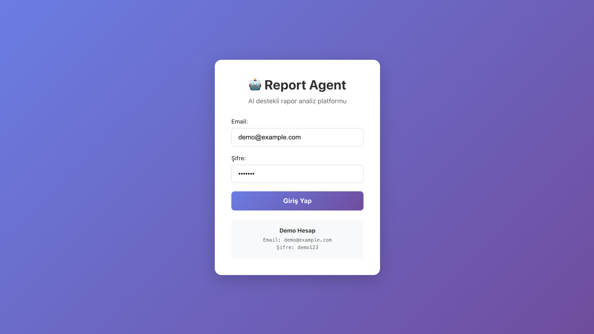
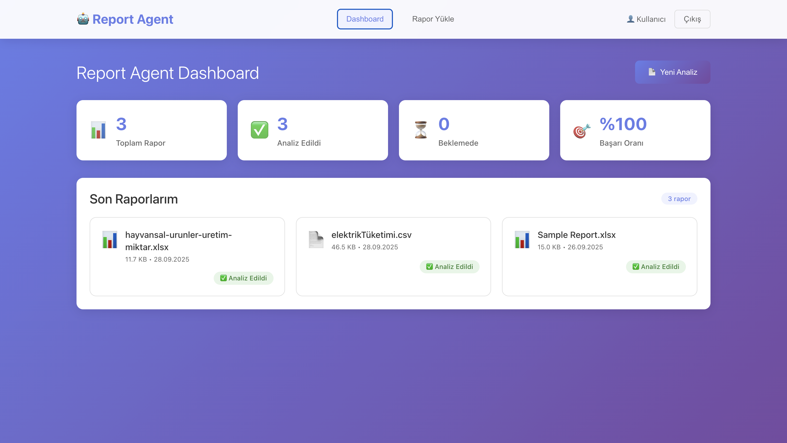
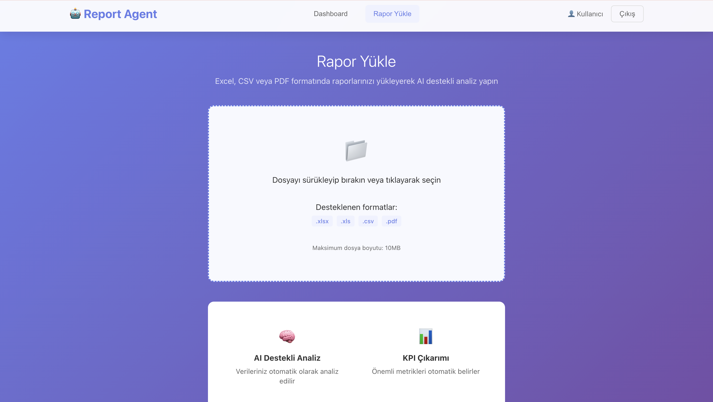
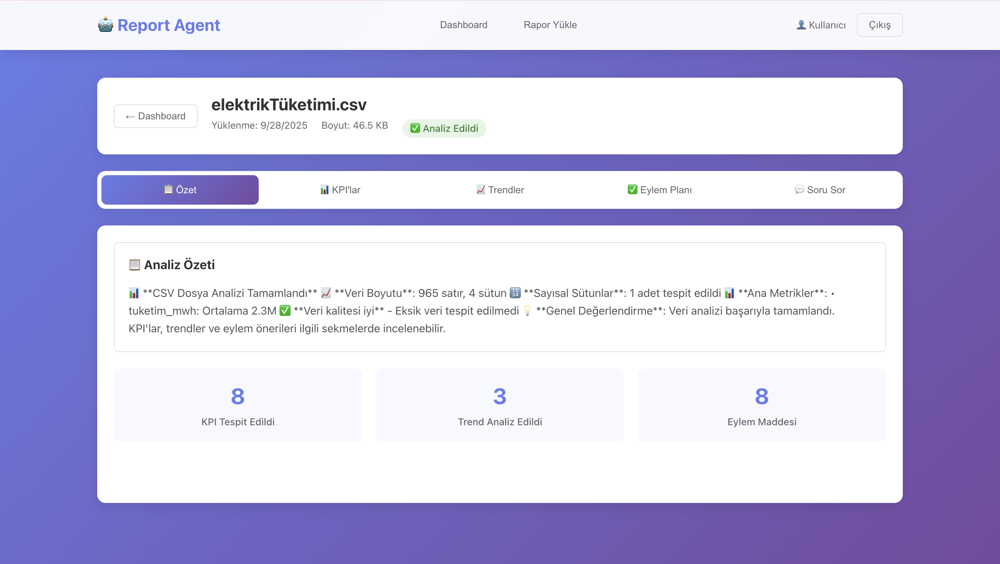
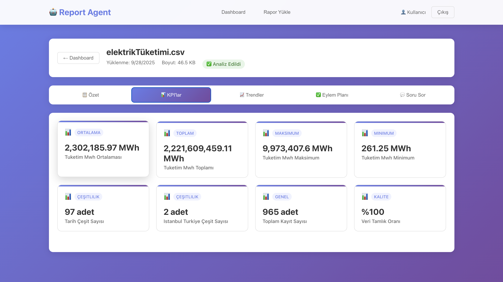
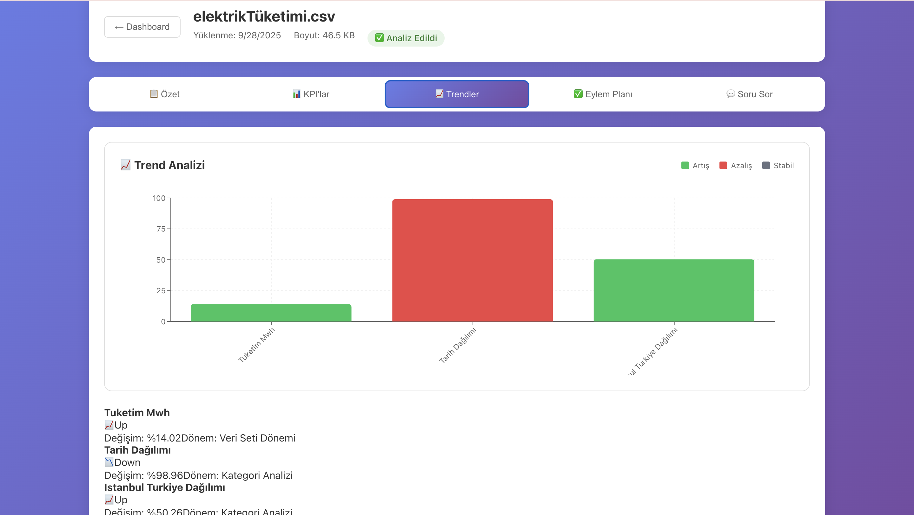
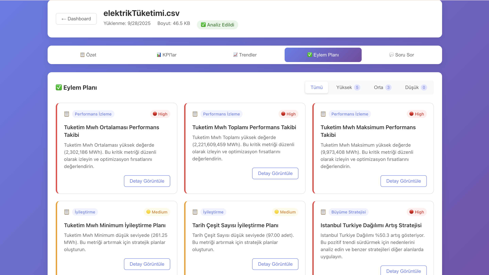
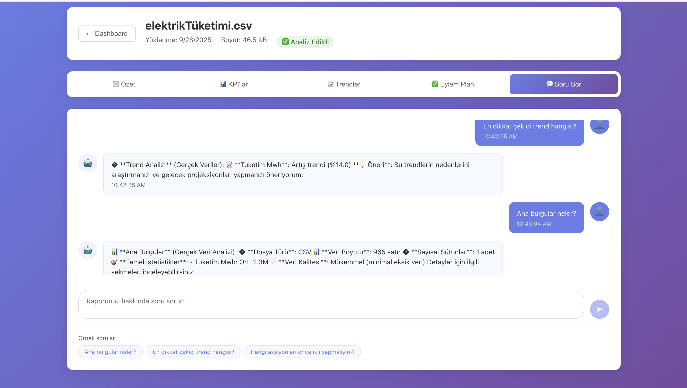

# Yapay-Zeka-Destekli-Report-Agent# 🤖 Report Agent - AI Destekli Rapor Analiz Platformu

AI teknolojisi ile büyük veri setlerini analiz eden, KPI'ları çıkaran, trendleri belirleyen ve eylem önerileri sunan modern bir rapor analiz platformu.

## 📸 Ekran Görüntüleri

### 🔐 Giriş Ekranı

*Güvenli JWT tabanlı kimlik doğrulama sistemi*

### 📊 Ana Dashboard

*Analiz edilmiş raporların özet görünümü ve istatistikleri*

### 📤 Rapor Yükleme

*Drag & drop ile kolay dosya yükleme - Excel, CSV, PDF desteği*

### 📈 Özet Çıkarım Analizi

*Yüklenen verinin özet bilgilerinin çıkarılması*

### 📈 KPI Analizi

*Otomatik çıkarılan anahtar performans göstergeleri*

### 📉 Trend Analizi

*Görsel grafik ile veri trendleri ve analiz sonuçları*

### ✅ Eylem Planı

*AI tarafından önerilen eylem maddeleri ve öncelik seviyeleri*

### 💬 Soru-Cevap Sistemi

*Doğal dille rapor hakkında soru sorma imkanı*

## 🚀 Özellikler

### ✨ Ana Özellikler
- **AI Destekli Analiz**: OpenAI GPT modelleri ile akıllı veri analizi
- **Çoklu Dosya Formatı**: Excel (.xlsx, .xls), CSV, PDF desteği
- **KPI Çıkarımı**: Otomatik anahtar performans göstergesi belirleme  
- **Trend Analizi**: Veri trendlerinin görselleştirilmesi ve analizi
- **Eylem Önerileri**: Analiz sonuçlarına dayalı aksiyon maddeleri
- **Soru-Cevap**: Doğal dille rapor hakkında soru sorma imkanı
- **Modern UI/UX**: React.js ile responsive ve kullanıcı dostu arayüz

### 🏗️ Teknik Özellikler
- **Mikroservis Mimarisi**: .NET 7 Backend + Python FastAPI AI Service
- **Gerçek Zamanlı Analiz**: FastAPI ile hızlı veri işleme
- **Güvenli Kimlik Doğrulama**: JWT tabanlı authentication
- **Scalable Database**: PostgreSQL ile performanslı veri saklama
- **Docker Support**: Container tabanlı deployment
- **REST API**: Swagger UI ile kapsamlı API dokümantasyonu

## 📋 Sistem Gereksinimleri

- **Docker & Docker Compose** (Önerilen)
- **Node.js 18+** (Frontend development için)
- **.NET 7.0 SDK** (Backend development için) 
- **Python 3.11+** (AI service development için)
- **PostgreSQL 15+** (Database)

## 🛠️ Kurulum

### 1. Projeyi İndirin
```bash
git clone https://github.com/your-username/report-agent.git
cd report-agent
```

### 2. Environment Dosyasını Hazırlayın
Docker Compose dosyasındaki environment değişkenlerini güncelleyin:

```yaml
# ai-service environment
OPENAI_API_KEY: "your-openai-api-key-here"

# backend environment  
ConnectionStrings__DefaultConnection: "Host=database;Database=ReportAgentDB;Username=postgres;Password=1234qwer"
JWT__Key: "your-super-secret-jwt-key-here-make-it-long-and-secure"
```

### 3. Docker ile Çalıştırma (Önerilen)
```bash
# Tüm servisleri başlatın
docker-compose up -d

# Logları takip edin
docker-compose logs -f

# Servisler:
# - Frontend: http://localhost:3000
# - Backend API: http://localhost:5001  
# - AI Service: http://localhost:8000
# - Database: localhost:5432
```

### 4. Manuel Kurulum (Development)

#### Backend (.NET 7)
```bash
cd backend/ReportAgent.API

# Paketleri yükleyin
dotnet restore

# Database migration (Otomatik SQL scriptler ile)
# Docker container çalıştığında otomatik oluşturulur

# Uygulamayı çalıştırın
dotnet run
# API: http://localhost:5001
```

#### AI Service (Python)
```bash
cd ai-service/Microservice

# Virtual environment oluşturun
python -m venv venv
source venv/bin/activate  # Linux/Mac
# venv\Scripts\activate   # Windows

# Gereksinimleri yükleyin
pip install -r requirements.txt

# Servisi başlatın
uvicorn app.main:app --reload --host 0.0.0.0 --port 8000
# AI Service: http://localhost:8000
```

#### Frontend (React 18)
```bash
cd frontend

# Bağımlılıkları yükleyin
npm install

# Development server'ı başlatın
npm start
# Frontend: http://localhost:3000
```

#### Database (PostgreSQL)
```bash
# PostgreSQL kurulumu (Ubuntu/Debian)
sudo apt update
sudo apt install postgresql postgresql-contrib

# Database ve kullanıcı oluşturma
sudo -u postgres psql
CREATE DATABASE ReportAgentDB;
CREATE USER postgres WITH ENCRYPTED PASSWORD '1234qwer';
GRANT ALL PRIVILEGES ON DATABASE ReportAgentDB TO postgres;
\q

# SQL scriptleri otomatik çalışır (Docker ile)
```

## 🔧 Konfigürasyon

### Environment Variables

#### Backend (.NET 7)
```bash
ConnectionStrings__DefaultConnection=Host=localhost;Database=ReportAgentDB;Username=postgres;Password=1234qwer
JWT__Key=your-super-secret-jwt-key-here-make-it-long-and-secure
AIService__BaseUrl=http://localhost:8000
ASPNETCORE_ENVIRONMENT=Development
```

#### AI Service (Python FastAPI)
```bash
OPENAI_API_KEY=sk-your-openai-api-key-here
DEBUG=True
```

#### Frontend (React)
```bash
REACT_APP_API_URL=http://localhost:5001/api
```

## 💡 Kullanım

### 1. Giriş Yapın
- **Demo Hesap**: demo@example.com / demo123
- Veya kendi hesabınızı oluşturun

### 2. Rapor Yükleme
1. "Yeni Analiz" butonuna tıklayın
2. Excel, CSV veya PDF dosyanızı sürükleyip bırakın
3. Dosya otomatik olarak yüklenecek ve analiz başlayacak

### 3. AI Analizi
Dosya yüklendikten sonra AI analizi otomatik başlar ve şunları görürsünüz:

- **📊 Özet**: Raporun genel değerlendirmesi
- **📈 KPI'lar**: Anahtar performans göstergeleri (Ortalama, Toplam, Maksimum, Minimum değerler)
- **📉 Trendler**: Veri trendleri ve interaktif grafikler
- **✅ Eylem Planı**: Önceliklendirilmiş aksiyonlar (Yüksek, Orta, Düşük)

### 4. Soru-Cevap
- "Soru Sor" sekmesinden raporunuz hakkında doğal dille sorular sorabilirsiniz
- Örnek sorular: "En dikkat çekici trend hangisi?", "Ana bulgular neler?", "Hangi aksiyonları öncelikli yapmalıyım?"

## 🏛️ Mimari

```
┌─────────────────┐    ┌──────────────────┐    ┌─────────────────┐
│   React.js      │────│  ASP.NET Core    │────│ Python FastAPI  │
│   Frontend      │    │   Web API        │    │   AI Service    │
│   (Port 3000)   │    │   (Port 5001)    │    │   (Port 8000)   │
└─────────────────┘    └──────────────────┘    └─────────────────┘
                               │                          │
                       ┌───────▼────────┐        ┌───────▼────────┐
                       │  PostgreSQL    │        │   OpenAI API   │
                       │   Database     │        │   (External)   │
                       │   (Port 5432)  │        └────────────────┘
                       └────────────────┘
```

### Servis Sorumlulukları

**Frontend (React.js 18)**
- Kullanıcı arayüzü ve etkileşim
- React Dropzone ile dosya yükleme
- Recharts ile dashboard grafikleri  
- Responsive tasarım

**Backend (ASP.NET Core 7)**
- RESTful API endpoints
- JWT Authentication & Authorization
- Entity Framework Core ile ORM
- File management ve upload handling
- AI service orchestration

**AI Service (Python FastAPI)**
- Pandas ile dosya parsing (Excel, CSV, PDF)
- PyMuPDF ile PDF text extraction
- Veri analizi ve cleaning
- OpenAI API entegrasyonu
- Pydantic ile data validation

**Database (PostgreSQL 15)**
- Kullanıcı yönetimi (Users)
- Rapor metadata (Reports)
- Analiz sonuçları (AnalysisResults)
- KPI verileri (KPIs)
- Trend verileri (Trends)
- Eylem maddeleri (ActionItems)

## 🔌 API Dokümantasyonu

### Backend API Endpoints

#### Authentication
- `POST /api/auth/login` - Kullanıcı girişi
- `POST /api/auth/register` - Yeni kullanıcı kaydı

#### Reports
- `GET /api/reports` - Kullanıcının raporlarını listele
- `GET /api/reports/{id}` - Rapor detayını getir
- `POST /api/reports/upload` - Yeni rapor yükle
- `POST /api/reports/{id}/analyze` - Rapor analizini başlat
- `POST /api/reports/{id}/ask` - Rapor hakkında soru sor

#### AI Service Endpoints
- `POST /analyze` - Dosya analizi yap
- `POST /ask` - Soru-cevap endpoint
- `GET /health` - Servis sağlık durumu

**Swagger UI**: http://localhost:5001/swagger (Backend çalışırken)

## 📊 Desteklenen Dosya Formatları

### Excel Files (.xlsx, .xls)
- **openpyxl** kütüphanesi ile parsing
- Çoklu worksheet desteği
- Formül ve hesaplama tanıma
- Metadata analizi

### CSV Files (.csv)
- **pandas** ile otomatik delimiter algılama
- UTF-8 encoding desteği
- Header tanıma ve veri tipi algılama
- Large file handling

### PDF Files (.pdf)
- **PyMuPDF** ile metin extraction
- Tablo algılama ve parsing
- Multi-page support
- Metadata okuma

## 🤖 AI Özellikleri

### Doğal Dil İşleme
- OpenAI GPT-3.5/GPT-4 entegrasyonu
- Türkçe dil desteği
- Context-aware responses
- Intelligent summarization

### Veri Analizi Capabilities
- **Pandas** ile istatistiksel analiz
- Korelasyon analizi
- Trend detection ve pattern recognition
- Outlier detection
- Otomatik KPI çıkarımı

### Desteklenen KPI Türleri
- **ORTALAMA**: Sayısal verilerin ortalaması
- **TOPLAM**: Sum agregasyonları  
- **MAKSIMUM/MINIMUM**: Min/max değerler
- **ÇEŞİTLİLİK**: Unique değer sayıları
- **KALITE**: Yüzdelik oranlar
- **GENEL**: Custom business KPIs

## 🔒 Güvenlik

- **JWT Authentication**: Secure token-based auth
- **BCrypt**: Password hashing
- **Input Validation**: XSS ve injection koruması
- **File Type Validation**: Güvenli dosya yükleme
- **CORS Configuration**: Cross-origin güvenlik
- **Environment Variables**: Sensitive data protection

## 📈 Kullanılan Teknolojiler

### Frontend
- **React 18.2.0** - Modern UI framework
- **React Router DOM 6.8.1** - Client-side routing
- **React Dropzone 14.2.3** - Drag & drop file upload
- **Recharts 2.5.0** - Chart ve grafik kütüphanesi

### Backend
- **.NET 7.0** - Modern web framework
- **Entity Framework Core 7.0.5** - ORM
- **Npgsql 7.0.4** - PostgreSQL provider
- **JWT Bearer 7.0.5** - Authentication
- **BCrypt.Net 4.0.3** - Password hashing
- **Swashbuckle 6.4.0** - API documentation

### AI Service
- **FastAPI 0.104.1** - Modern Python web framework
- **Pandas 2.1.4** - Data analysis
- **OpenAI 1.3.0** - AI API integration
- **PyMuPDF 1.23.8** - PDF processing
- **openpyxl 3.1.2** - Excel file handling
- **Pydantic 2.5.0** - Data validation

## 🧪 Test Etme

### Backend Tests
```bash
cd backend
dotnet test
```

### Frontend Tests  
```bash
cd frontend
npm test
npm run test:coverage
```

### AI Service Tests
```bash
cd ai-service/Microservice
python -m pytest
```

## 🚀 Production Deployment

### Docker Production
```bash
# Production ortamı için environment variables güncelleyin
# SSL sertifikası ekleyin
# Reverse proxy yapılandırın (Nginx)

docker-compose -f docker-compose.prod.yml up -d
```

### Performans Optimizasyonları
- **React Production Build**: Minified bundle
- **Database Connection Pooling**: EF Core
- **API Rate Limiting**: Middleware
- **Static File Serving**: Nginx
- **Caching Strategy**: Redis (opsiyonel)

## 🔧 Troubleshooting

### Yaygın Sorunlar

**Docker Container Başlatma Sorunu**
```bash
# Portları kontrol edin
lsof -i :3000,5001,8000,5432

# Container loglarını kontrol edin
docker-compose logs backend
docker-compose logs ai-service
```

**OpenAI API Key Error**
```bash
# API key'i docker-compose.yml dosyasında güncelleyin
# Quota limitlerini kontrol edin
# https://platform.openai.com/account/usage
```

**Database Connection Error**
```bash
# PostgreSQL container'ın ayakta olduğunu kontrol edin
docker-compose ps database

# Connection string'i kontrol edin
# Firewall ayarlarını kontrol edin (5432 portu)
```

**File Upload Issues**
```bash
# Upload dizininin izinlerini kontrol edin
ls -la backend/uploads/

# Dosya boyutu limitlerini kontrol edin (10MB default)
# Desteklenen formatları kontrol edin (.xlsx, .xls, .csv, .pdf)
```

## 🤝 Katkıda Bulunma

1. Fork the repository
2. Create your feature branch (`git checkout -b feature/amazing-feature`)
3. Commit your changes (`git commit -m 'Add some amazing feature'`)
4. Push to the branch (`git push origin feature/amazing-feature`)
5. Open a Pull Request

## 📝 Lisans

Bu proje MIT lisansı altında lisanslanmıştır. Detaylar için `LICENSE` dosyasını inceleyin.

## 📞 İletişim & Destek

**Proje Sahibi**: Enes Faruk Keskin
- **GitHub**: [@enesfarukkeskin](https://github.com/enesfarukkeskin)
- **LinkedIn**: [Enes Faruk Keskin](https://www.linkedin.com/in/enesfarukkeskin/)
- **Email**: enesfarukkeskin@gmail.com

### Demo Credentials
- **Email**: demo@example.com
- **Şifre**: demo123

---

**🚀 Report Agent ile verilerinizi daha akıllı analiz edin!**